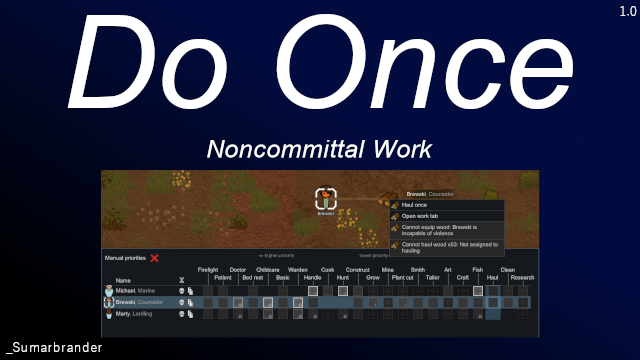

Portions of the materials used to create this content/mod are trademarks and/or copyrighted works of Ludeon Studios Inc. All rights reserved by Ludeon. This content/mod is not official and is not endorsed by Ludeon. 

<h1>Do Once - Noncommittal Work</h1>
<b>Do Once</b> is a Quality of Life mod to allow pawns to perform single jobs of work types they are not assigned. It mod adds two new context items when you right click things, work stations, and other items pawns use for work: 
<ul>
  
<li>A "Do once" option which forces the pawn to perform the work associated with whatever you right clicked exactly once. (e.g. Haul the stack of logs you clicked or cook one meal at the stove you clicked.)
<li>An "Open work tab" option that opens the work tab and highlights the work type pawn so it's super easy to assign priority for that work type.
</ul>

  The options only appear if the pawn is unassigned to do the work type the item is used for and if they are capable of the work type.

  These features are borrowed from Better Work Tab. I thought it would make a quite fine QOL mod on its own for people who don't want to commit to the full BWT transformation. 
  <i>While this mod is fully compatible with Better Work Tab, doing so is redundant since this mod is borrowing BWT's functionality.</i>
